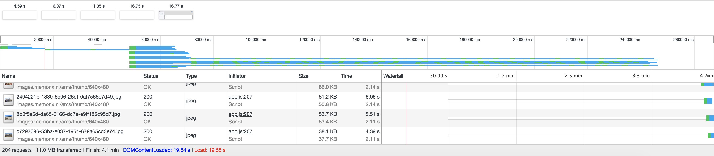

# Performance Matters: Server Side

The original "Amsterdams Vault" repository can be found [here](https://github.com/Jamerrone/amsterdams-vault).

## Getting Started

These instructions will get you a copy of the project up and running on your local machine for development and testing purposes.

### Installing

After cloning the repository you can install the required dependencies using npm:

```javascript
$ npm install
```

### Usage

In order to launch a development environment:

```javascript
$ npm run start
```

In order to compile and minify your JavaScript: *(Runs by default while using ```$ npm run start```.)*

```javascript
$ npm run compile
```

## From Client-Side to Server-Side

For this assignment, I had to rewrite my Amsterdams Vault repository using server-side techniques. The original version rendered the entire HTML using client-side JavaScript. There are multiple reasons why server-side rendering is a better approach. For example, faster and better performance and better overall support. Based on the short deadline I was unable to rebuild the entire web application server-side, however, my core functionalities are currently rendered server-side.

**Missing features from the original repository:**

* Leaflet Map displaying the currently selected street.
* Lightbox functionality for each individual picture.

**Original Repository**


**Server-Side Rendering**


I still chose to use client-side JavaScript for user experience enhancements. For example, if JavaScript is turned on, a search bar appears where users can fuzzy search every street from Amsterdam. My picture timeline also gets enhanced with some extra slider functionality, like automatically scrolling.

People without JavaScript are still able to navigate through the timeline using there mouse or keyboard. While they are unable to search using the search bar they can still filter their content by each letter of the alphabet.

## NPM Scripts, CommonJS & Browserify

For this project, I chose to use ES6 syntax and techniques. However not every browser supports every new feature, in order to keep the support as high as possible, I chose to compile my JS files to plain and old vanilla ES5 using [Babel](https://babeljs.io/).

In order to keep my project files as readable and expandable as possible, I used [Browserfy](http://browserify.org/) to combine and bundle the different JavaScript modules.

Normally I use [Gulp](https://gulpjs.com/) as my primary task runner, however, for this project I had to use npm scripts. I kept it simple and wrote 2 scripts in total. The ```$ npm run compile``` script bundles the different JavaScript files and minifies the newly generated file. The ```$ npm run start``` script is used to create a localhost server based on Express. The full dependency list can be found inside the package.json file.

## Performance Optimization

*All tests are performed using the "Slow 3G" option from the Google Chrome Developer Tools with cache turned off.*

### Run 1: Client Side



4 minutes is of course extremely slow and unacceptable. First of all, I should like to make clear that the [Adamlink](https://adamlink.nl/) API used for this project is extremely slow. Other then the bad API performance, most of the content is rendered using client-side JavaScript, every image is loaded at the same time and most of the time there are over 1000 images requested. Last but certainly not least, the [Leaflet](http://leafletjs.com/examples.html) map rendering process can be quite slow. Overall extremely bad performance.

* **Total load time:** 04.10m

### Run 2: Server Side


After rewriting the entire codebase using [Express](https://expressjs.com/), [Pug](https://pugjs.org/api/getting-started.html) and [Node](https://nodejs.org/en/) I was able to reduce the total load time by almost 1 minute. However, I am unable to calculate how much performance I actually gained by rendering the HTML server-side because I also deleted the entire [Leaflet](http://leafletjs.com/examples.html) map and it's dependencies. Overall great performance boost but still extremely slow.

* **Total load time:** 03.30m

### Run 3: JS + CSS Minification & Critical CSS


The first thing I did after rewriting the codebase was minifying the JavaScript files using [UglyfyJS](https://github.com/mishoo/UglifyJS2) and minifying the CSS file. My next step was generating the required critical CSS, in my case, this meant the entire CSS file. Other than the smaller file sizes it didn't really result in any performance gain. In the end, not a single second was gained.

* **Total load time:** 03.30m

### Run 4: Images Lazy Loading


What a boost! I went from over 3 minutes to 28 and a half seconds. My biggest issue was the large number of images being rendered at the same time. Using [Lazyload](https://www.npmjs.com/package/lazyload) I was able to implement lazy loading with resulted in a performance boost I had not expected. Overall extremely pleased with the results so far.

* **Total load time:** 28.29s

### Run 5: Minify HTML


Every millisecond count, even when the differences are invisible, right? Yeah... Anyway, next I minified my server-side rendered HTML file using the Express middleware [express-minify-html](https://github.com/Konnng/express-minify-html).

* **Total load time:** 28.16s

### Run 6: gZip


Enabling gZip with [Compression](https://www.npmjs.com/package/compression) was my last optimization step for this project. It resulted in an 8 seconds performance gain. On faster networks, the website renders almost immediately. Overall I am extremely happy with how this project turned out.

* **Total load time:** 20.08s